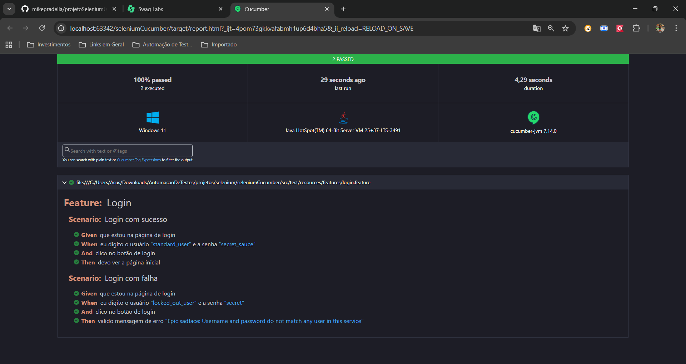

# ProjetoSeleniumJava2025

# Projeto de Automação de Testes Web

Este projeto tem como objetivo demonstrar automação de testes web utilizando **Java**, **Selenium WebDriver**, **Cucumber** e **JUnit**. Ele pode ser usado como referência em entrevistas técnicas ou para aprendizado.

## Tecnologias Utilizadas

- Java 11+
- Maven
- Selenium WebDriver
- Cucumber (BDD)
- JUnit
- IntelliJ IDEA

## Estrutura do Projeto

- `src/main/java`: Código utilitário e suporte (ex: `utils/WebUtils.java`)
- `src/test/java/steps`: Classes de Step Definitions do Cucumber
- `src/test/java/hooks`: Hooks para inicialização e finalização do WebDriver
- `src/test/resources/features`: Arquivos `.feature` com cenários de teste em Gherkin
- `src/test/java/runner`: Runner do Cucumber para execução dos testes

## Como Executar

1. **Instale o Java e o Maven** em sua máquina.
2. **Clone este repositório**:
3. **Abra o projeto no IntelliJ IDEA**.
4. **Execute os testes** pelo runner:
   - Localize o arquivo `RunnerTest.java` em `src/test/java/runner`.
   - Clique com o botão direito e selecione `Run`.

## Exemplos de Testes

Os cenários de teste estão descritos em arquivos `.feature` usando a linguagem Gherkin, por exemplo:
## Relatórios

Após a execução, um relatório HTML será gerado em `target/report.html`.

## Observações

- O WebDriver é inicializado automaticamente nos hooks (`@Before` e `@After`).
- Os utilitários para manipulação de elementos web estão em `utils/WebUtils.java`.
- Os pacotes `steps` e `hooks` devem estar configurados corretamente no runner.

## Dúvidas

Qualquer dúvida, entre em contato !

## Exemplo do Relatorio

